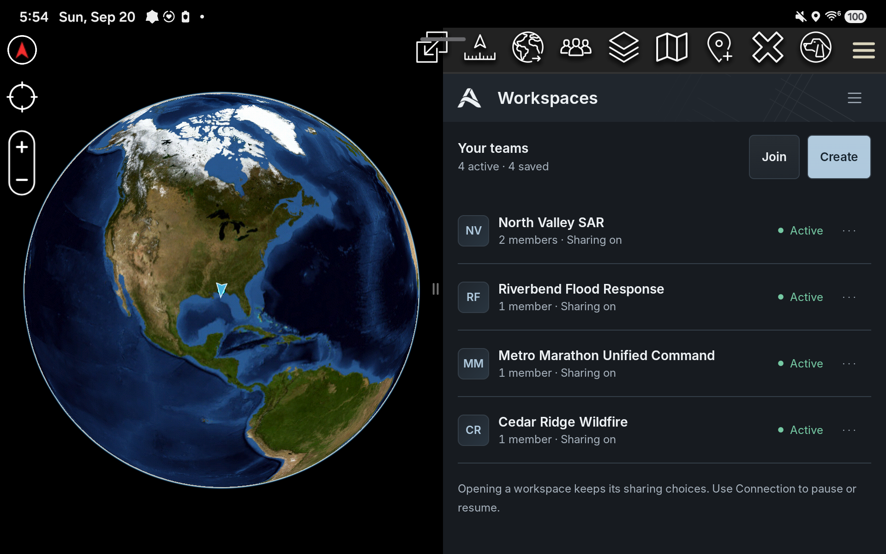

# Arachne for ATAK

**Want to run ATAK without setting up a TAK Server? This is the plugin for you.**

> [!NOTE]
> Arachne is an ATAK-CIV add-on. Install ATAK-CIV and Arachne on each phone.
> One person creates a group, shares a link or QR code, and everyone joins.

[**Download Arachne APK**](https://github.com/arachne-systems/arachne-atak/releases)

ATAK is an Android app for shared maps, location sharing, chat, and team
coordination. Arachne makes it easy for anyone to create a private ATAK group.

Create a group, share an invitation link or QR code, and let people join. With
internet access, group members can find each other and share the ATAK
information they choose.

> [!TIP]
> The user workflow is simple: install Arachne, create a group, share an
> invitation, and join over the internet. Arachne handles the network,
> membership, and security setup.

## How it feels to use

1. Install Arachne in ATAK.
2. Create a group. Arachne calls it a **workspace**.
3. Share the invitation link or QR code.
4. Members join and continue using ATAK normally.

The people in your group become available as ATAK contacts. You can keep using
ATAK's map, Chat, location sharing, map points, drawings, and data packages.
Arachne handles the secure membership and connections in the background.

> [!NOTE]
> Internet access and an invitation are enough to join the group.

## What you get

- Make whatever private groups you need: a response team, a search-and-rescue
  team, a training group, or an ATAK hobby group.
- Invite people with a link, QR code, or nearby discovery.
- Choose what your device shares with each group.
- Add or remove members and pause a group when you are done.
- Share live information and ATAK Data Packages with your group.
- Choose an Iroh transport profile, including Tor-only operation when a local
  Tor service is available.

## Who is this for?

- First responders and volunteer organizations that need to get a team working
  quickly.
- Search-and-rescue, emergency-management, and field teams.
- ATAK hobbyists and small groups focused on ATAK, with server operations out
  of the way.
- Anyone who wants to create a private group and get started in the app.

## A practical alternative to TAK Server

For organizations that need central administration, formal integration, or an
existing TAK deployment, TAK Server remains a strong choice. Arachne gives
smaller and temporary groups a secure, lower-friction way to get started.

## Why Arachne exists

Before Arachne, I created the original **ZeroTAK** approach: use ZeroTier as a
lightweight network for ATAK phones before a TAK Server was in place.
ATAK-Release coined the name “ZeroTAK.” The community documented that early
work as [ZeroTAKServer](https://www.civtak.org/2020/04/06/ztakserver-easy-light-weight-private/)
in 2020.

ZeroTAK helped early first responders bring ATAK into real-world work. It was
the simplest workable path at the time. That approach also put private VPN
management on the user: keep it enabled, maintain the network, and work around
conflicts with other VPNs.

I have also set up dozens of TAK Servers and still maintain several at a time:
Docker deployments, Debian and RPM packages, Kubernetes, exercise networks,
and multinational exercises with FedHub. TAK Server is a great tool, and for
many military organizations it is the right answer—especially when they have
the people and support structure to run it.

TAK Server is essential for some deployments. Hobbyists, volunteer teams, and
small organizations often need a lighter operational model. Hosting a server at
home or in the cloud brings public exposure, certificate management, group
configuration, patching, monitoring, and incident response into the job. That
operational burden can overshadow the reason people wanted ATAK in the first
place.

Arachne brings group setup, membership, and network coordination into the
product. Small teams can start with a secure group, while organizations that
need server control can continue to run TAK Server. The security work remains
real; Arachne makes it part of the product so operators can focus on the mission.

## The bigger picture

The ATAK plugin is the first Arachne project. The larger goal is to let other
apps, feeds, and services join the same groups. Projects can then focus on
their own capabilities while using a shared communication fabric.

## Try it

1. Install a compatible ATAK-CIV host on the Android device.
2. Download the APK from the [Releases](https://github.com/arachne-systems/arachne-atak/releases)
   page.
3. Install the APK, then enable Arachne through ATAK's plugin controls.
4. Open **Arachne → Workspaces** and create or join a workspace.

Keep invitations and QR codes private. They are access material for a group.

### Tor-only transport (experimental)

Open **Arachne → Settings → Iroh transport**, enable **Use Tor only**, and
reopen the workspace session. Each member must use Tor and have a local Tor
daemon available at `127.0.0.1:9050` (SOCKS) and `127.0.0.1:9051` (control).

Tor uses the authenticated Iroh endpoint identity to resolve peers through Tor.
The Tor profile does not store or use IP address hints and does not fall back to
direct IP or Iroh relay paths. Workspace-wide publications can still converge
through the Arachne Gossip overlay; direct recipient and control operations
still require a reachable endpoint.

> [!WARNING]
> This is an alpha evaluation build. Current validation covers ATAK-CIV 5.8.0,
> selected Android environments, development-scale membership tests, and a
> three-device Tor mesh qualification.
> Evaluate compatibility, network behavior, and operational requirements for
> your deployment before relying on it in the field. Follow your organization's
> approved deployment process for operational systems.

Current build details

- Arachne: `0.0.2-alpha` (version code `5`)
- Host: ATAK-CIV `5.8.0` / SDK mapping `5.8.0.4`
- Android: API `26` or newer
- Architectures: `arm64-v8a` and `x86_64`

### Testing so far

> [!NOTE]
> A development test admitted 500 simulated members across three Android
> devices. This measures membership admission at that size. Feature coverage
> for 500 active users and difficult-network testing continue.

## Technical details

Arachne combines a Kotlin ATAK adapter, a portable Rust fabric, MLS/OpenMLS
workspace security, Iroh peer connectivity, publish/subscribe routing, and
protected delivery. The technical architecture explains how those pieces work
together for ATAK contacts, PLI, Chat, map data, feeds, and Data Packages.

Read the full [technical architecture](docs/technical-architecture.md),
including diagrams, identity and permission boundaries, delivery and recovery,
persistence, and current qualification status.

## Feedback

Use [GitHub Issues](https://github.com/arachne-systems/arachne-atak/issues) for
bug reports and product feedback. Include Arachne, ATAK, Android, and device
versions, along with the exact steps and result. Redact invitations, keys,
locations, personal information, and other sensitive data from diagnostics.

## Licensing and external inputs

The Arachne source is currently being refactored. See [LICENSE](LICENSE) and
[NOTICE.md](NOTICE.md) for the current release terms.

Builders obtain the ATAK host, ATAK SDK, SDK JARs or AARs, TAK developer
tooling, signing keys, and restricted TAK material separately under their
applicable TAK terms. Third-party components retain their own licenses and
notices.

Arachne is an independent project, separate from the TAK Product Center,
TAK.gov, and U.S. Government product lines.
