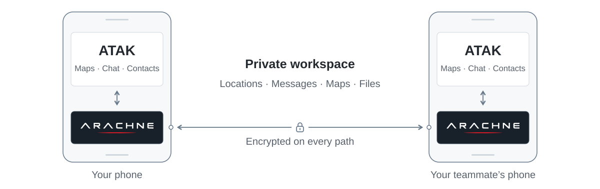
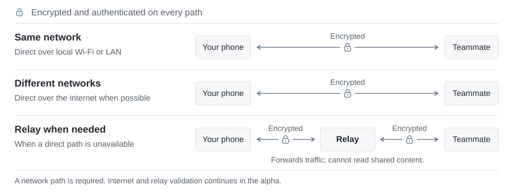

# Arachne for ATAK

**Connect your ATAK team. No TAK Server required.**

Arachne is an ATAK plugin that connects your team's devices in a private
**workspace**. Share locations, messages, map points, drawings, feeds and
Data Packages through ATAK's existing tools. Every connection is encrypted
and authenticated over its secure mesh.

<picture>
  <source media="(prefers-color-scheme: dark)" srcset="docs/promo/assets/arachne-overview-dark.svg">
  
</picture>

## Get started

For this alpha, use **ATAK-CIV 5.8.0.5** on **Android 8.0 or newer**.
Devices need a usable connection over local Wi-Fi, a LAN or the internet.

> **Alpha evaluation build.** Current validation covers selected Android
> environments and development-scale membership tests. Evaluate on your devices
> and networks before operational use, following your organization's approved
> deployment process.

1. **Install.** [Download Arachne 0.0.3-alpha](https://github.com/arachne-systems/arachne-atak/releases/tag/v0.0.3-alpha)
   and install it alongside ATAK-CIV on each device.
2. **Create.** Open Arachne in ATAK and create a workspace for your team.
3. **Invite.** Share the invitation link or QR code with your teammates.
4. **Share.** Teammates join the workspace and use ATAK as usual.


## How it works

1. Install Arachne in ATAK.
2. Create a group. Arachne calls it a **workspace**.
3. Share the invitation link or QR code.
4. Members join and continue using ATAK normally.

The people in your group become available as ATAK contacts. You can keep using
ATAK's map, Chat, location sharing, map points, drawings, and data packages.
Arachne handles the secure membership and connections in the background.

> [!NOTE]
> Internet access and an invitation are enough to join the group.

## What you get

- Make whatever private groups you need: a response team, a search-and-rescue
  team, a training group, or an ATAK hobby group.
- Invite people with a link, QR code, or nearby discovery.
- Choose what your device shares with each group.
- Add or remove members and pause a group when you are done.
- Share live information and ATAK Data Packages with your group.
- Choose an Iroh transport profile, including Tor-only operation when a local
  Tor service is available.

The portable core supports caller-supplied Iroh relay maps for managed
deployments. See [Arachne Core](https://github.com/arachne-systems/arachne-core)
and the [Arachne Relay deployment recipe](https://github.com/arachne-systems/arachne-relay).
The ATAK plugin currently offers automatic and relay-only profiles, but does
not let operators enter a custom relay URL.

## Who is this for?

- First responders and volunteer organizations that need to get a team working
  quickly.
- Search-and-rescue, emergency-management, and field teams.
- ATAK hobbyists and small groups focused on ATAK, with server operations out
  of the way.
- Anyone who wants to create a private group and get started in the app.

## A practical alternative to TAK Server

For organizations that need central administration, formal integration, or an
existing TAK deployment, TAK Server remains a strong choice. Arachne gives
smaller and temporary groups a secure, lower-friction way to get started.

## Why Arachne exists

Before Arachne, I created the original **ZeroTAK** approach: use ZeroTier as a
lightweight network for ATAK phones before a TAK Server was in place.
ATAK-Release coined the name “ZeroTAK.” The community documented that early
work as [ZeroTAKServer](https://www.civtak.org/2020/04/06/ztakserver-easy-light-weight-private/)
in 2020.

ZeroTAK helped early first responders bring ATAK into real-world work. It was
the simplest workable path at the time. That approach also put private VPN
management on the user: keep it enabled, maintain the network, and work around
conflicts with other VPNs.

I have also set up dozens of TAK Servers and still maintain several at a time:
Docker deployments, Debian and RPM packages, Kubernetes, exercise networks,
and multinational exercises with FedHub. TAK Server is a great tool, and for
many military organizations it is the right answer—especially when they have
the people and support structure to run it.

TAK Server is essential for some deployments. Hobbyists, volunteer teams, and
small organizations often need a lighter operational model. Hosting a server at
home or in the cloud brings public exposure, certificate management, group
configuration, patching, monitoring, and incident response into the job. That
operational burden can overshadow the reason people wanted ATAK in the first
place.

Arachne brings group setup, membership, and network coordination into the
product. Small teams can start with a secure group, while organizations that
need server control can continue to run TAK Server. The security work remains
real; Arachne makes it part of the product so operators can focus on the mission.

## The bigger picture

The ATAK plugin is the first Arachne project. The larger goal is to let other
apps, feeds, and services join the same groups. Projects can then focus on
their own capabilities while using a shared communication fabric.

## Try it

1. Install a compatible ATAK-CIV host on the Android device.
2. Download the APK from the [Releases](https://github.com/arachne-systems/arachne-atak/releases)
   page.
3. Install the APK, then enable Arachne through ATAK's plugin controls.
4. Open **Arachne → Workspaces** and create or join a workspace.

Keep invitations and QR codes private. They are access material for a group.

### Tor-only transport (experimental)

Open **Arachne → Settings → Iroh transport**, enable **Use Tor only**, and
reopen the workspace session. Each member must use Tor and have a local Tor
daemon available at `127.0.0.1:9050` (SOCKS) and `127.0.0.1:9051` (control).

Tor uses the authenticated Iroh endpoint identity to resolve peers through Tor.
The Tor profile does not store or use IP address hints and does not fall back to
direct IP or Iroh relay paths. Workspace-wide publications can still converge
through the Arachne Gossip overlay; direct recipient and control operations
still require a reachable endpoint.

> [!WARNING]
> This is an alpha evaluation build. Current validation covers ATAK-CIV 5.8.0.5,
> selected Android environments, development-scale membership tests, and a
> three-device Tor mesh qualification.
> Evaluate compatibility, network behavior, and operational requirements for
> your deployment before relying on it in the field. Follow your organization's
> approved deployment process for operational systems.

<details>
<summary>See the connection paths</summary>

<picture>
  <source media="(prefers-color-scheme: dark)" srcset="docs/promo/assets/arachne-connections-dark.svg">
  
</picture>

</details>

The ATAK plugin is the first application on the Arachne fabric. External apps,
feeds and services can use the same communication model through its portable
Rust interface. Read the [technical architecture](docs/technical-architecture.md)
for protocols, security, delivery and qualification details.

<details>
<summary>Build and validation details</summary>

- Arachne: `0.0.3-alpha` (version code `6`)
- Host: ATAK-CIV `5.8.0.5` / plugin API `com.atakmap.app@5.8.0.CIV`
- Release: [`v0.0.3-alpha`](https://github.com/arachne-systems/arachne-atak/releases/tag/v0.0.3-alpha)
- Android: API `26` or newer
- Architectures: `arm64-v8a` and `x86_64`
- A development test admitted 500 simulated members across three Android
  devices. This measures membership admission at that size; feature coverage
  for 500 active users and difficult-network testing continue.
- Public-internet and relay behavior, mixed ATAK versions, and large active
  deployments remain under validation.

</details>

## Build from source

Use JDK 17, Android SDK with NDK `27.1.12297006`, Rust `1.98.0` with the
`aarch64-linux-android` and `x86_64-linux-android` targets, and an authorized
ATAK-CIV `5.8.0.5` SDK obtained separately. The TAK SDK is not included.

```sh
git submodule update --init --recursive
rustup toolchain install 1.98.0
rustup target add --toolchain 1.98.0 aarch64-linux-android x86_64-linux-android
FABRIC_TAK_SDK=/path/to/ATAK-CIV-5.8.0.5-SDK \
ANDROID_HOME=/path/to/android-sdk scripts/build-plugin.sh
```

Set `FABRIC_NDK_VERSION` or `FABRIC_NDK_BIN` if the NDK is installed outside
`$ANDROID_HOME/ndk/27.1.12297006`.

For the repeatable source bundle, TPP handoff, signature verification, and
GitHub release steps, see the [TPP release process](docs/tpp-release-process.md).

## Feedback

Report bugs and product feedback in
[GitHub Issues](https://github.com/arachne-systems/arachne-atak/issues).
Include Arachne and ATAK versions, Android and device details, and steps to
reproduce the issue. Remove invitations, keys, locations, personal information
and other sensitive data from diagnostics.

## License and notices

See [LICENSE](LICENSE) and [NOTICE.md](NOTICE.md) for release terms and external
software requirements. ATAK and its SDK are obtained separately under their
own terms. Third-party components retain their own licenses and notices.

Arachne is an independent project unaffiliated with the TAK Product Center,
TAK.gov, and U.S. Government product lines.
