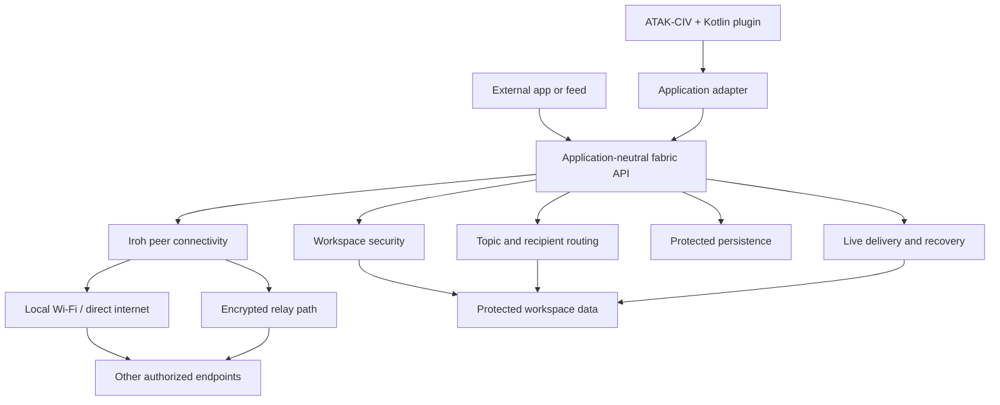
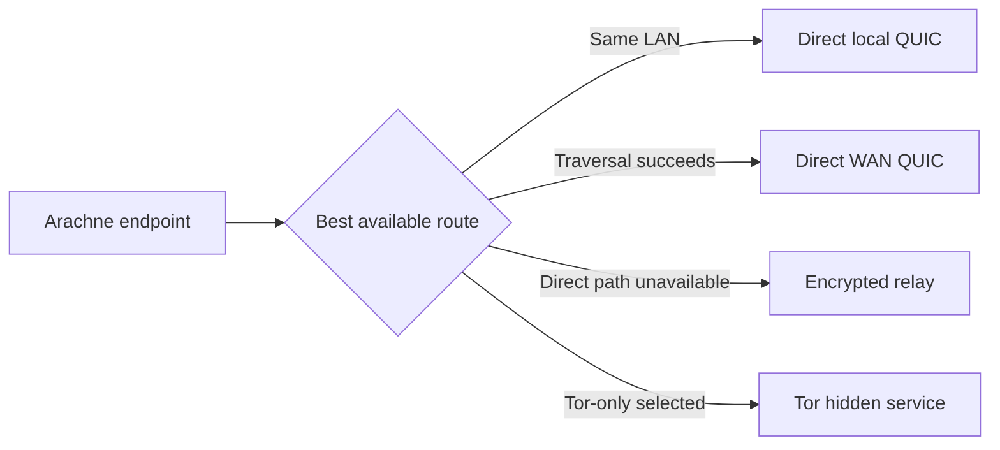
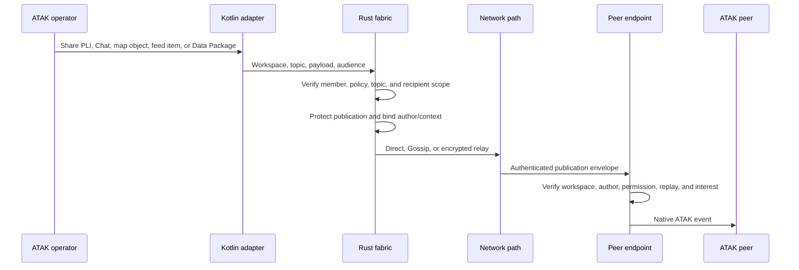

# Arachne technical architecture

[Back to the Arachne for ATAK README](../README.md)

> [!NOTE]
> This page explains what happens beneath the simple Arachne workflow. It is
> for curious operators, integrators, developers, and engineers, and covers the
> architecture, what exists today, what has been tested, and what is still
> being validated in the Arachne ATAK plugin.

## 1. Executive summary

Arachne is an embeddable, decentralized pub/sub fabric. Each participating
phone, application, or service runs a local Arachne endpoint. Endpoints join
protected workspaces, publish and subscribe to selected data, and communicate
over the best available network path.

The ATAK plugin is the first application on the fabric. It keeps ATAK's native
Contacts, Chat, PLI, map, feed, and Data Package workflows while Arachne supplies
workspace membership, authorization, routing, delivery, and recovery.

The same fabric can carry data from external applications and services. Those
participants use their own data formats and workflows through the
application-neutral Rust interface.

### Core design goals

| Goal | Architectural response |
| --- | --- |
| Simple operator workflow | Group creation, invitations, membership, and sharing are exposed through the ATAK plugin. |
| Strong workspace security | MLS/OpenMLS group state plus application-level permissions and admission policy. |
| Decentralized collaboration | Participant endpoints communicate directly when possible; discovery and relay helpers supply paths. |
| Native ATAK behavior | The adapter maps fabric events into existing ATAK contacts, Chat, PLI, map, and package workflows. |
| Reusable communication fabric | External apps, feeds, and services use the same pub/sub and delivery contracts. |
| Resilient data movement | Direct paths, Gossip dissemination, retained recovery, and resumable object transfer work together. |

The user-experience target is similar to Signal: the operator sees simple
groups and contacts while identity, key management, membership, encrypted
sessions, network changes, and delivery state are handled underneath. Arachne
applies that design goal to ATAK collaboration and multi-application data.

## 2. System architecture

### Required topology

The normal collaboration topology consists of participating endpoints and the
paths they discover or use. A central collaboration server is not part of the
required runtime shape. Discovery services return candidate routes, relay
services carry encrypted traffic when a direct path is unavailable, and the
optional Tor profile uses Tor hidden services without IP hints.

Workspace authority remains in the protected group state. A route provider or
transport relay has a networking role; membership and data permissions remain
workspace decisions.

## 3. Domain model

| Object | Definition | ATAK example |
| --- | --- | --- |
| **Endpoint** | A phone, application, or service running a local Arachne node. | An Android phone running ATAK and the plugin. |
| **Workspace** | A protected membership, authorization, and data-sharing boundary. | A response team or exercise group. |
| **Member** | An authorized participant in a workspace. | A responder shown as an ATAK contact. |
| **Topic** | A named stream with explicit publish and subscribe rules. | PLI, Chat, map points, or a sensor feed. |
| **Publication** | One protected piece of application data. | A position update, message, drawing, or feed observation. |
| **Data Package** | A larger immutable object transferred through the fabric. | An ATAK map or mission package. |
| **Relay** | A transport helper that carries encrypted traffic between endpoints. | A fallback path for a phone behind a difficult NAT. |

Topics and workspaces have different responsibilities. A workspace defines who
belongs and which security state applies. A topic selects a class of data. A
subscription expresses local interest in that data.

## 4. Responsibilities by layer

| Layer | Owns | ATAK-facing result |
| --- | --- | --- |
| **Kotlin ATAK adapter** | ATAK lifecycle, workspace UI, invitations, contacts, and native data translation. | Contacts, Chat, PLI, map objects, feeds, and package actions remain in ATAK. |
| **Fabric runtime** | Workspace sessions, commands, events, composition, and lifecycle. | The plugin receives bounded status and data events. |
| **Workspace security** | Membership, invitations, administrators, credentials, group keys, and protected transitions. | A joined member sees the contacts and data allowed by the workspace. |
| **Routing** | Topics, interests, publish permissions, recipient selection, and audience scope. | Operators choose which people receive PLI, Chat, maps, or feeds. |
| **Peer connectivity** | Endpoint authentication, discovery hints, dialing, path changes, and reconnect. | Contacts and shared data follow the device across usable network paths. |
| **Delivery and recovery** | Protected envelopes, bounded queues, publication history, and authorized recovery. | Live updates continue when available; supported retained data can be recovered after reconnect. |
| **Persistence** | Endpoint identity, workspace state, pending work, and retained records. | ATAK can reopen the local identity and workspace after restart. |

### Implementation boundary

The Kotlin adapter translates ATAK concepts at the edge. The portable Rust
fabric works with workspace IDs, member IDs, topics, permissions, protected
payloads, and delivery events. CoT and Android types stay in the adapter; feed
services can use the same Rust interface with their own payload schemas.

## 5. Identity and trust

Arachne separates the identity used to reach a device from the identity used to
authorize a workspace member and the identity ATAK uses for a contact or object.

| Identity | Answers | Current mechanism |
| --- | --- | --- |
| **Endpoint identity** | Which device or service accepted this transport connection? | Authenticated Iroh endpoint credentials. |
| **Workspace member identity** | Which authorized participant is acting in this workspace? | MLS/OpenMLS group state and workspace policy. |
| **ATAK identity** | Which contact or object should ATAK display or update? | Workspace-aware mapping in the ATAK adapter. |

> [!IMPORTANT]
> Connectivity supplies reachability. Workspace security supplies authority.
> A route, address, relay, ATAK callsign, or CoT UID does not answer the
> authorization question by itself.

### Workspace admission

1. An operator creates a workspace in ATAK and chooses its display name and
   sharing policy.
2. Arachne creates the local workspace security state and produces an invitation
   link or QR code.
3. A joiner opens the invitation in ATAK, chooses a display name, and prepares
   its member credentials.
4. The security layer validates the workspace checkpoint, invitation, member
   binding, and authorized admission transition.
5. The joined member receives workspace state and appears as an authorized ATAK
   contact. Routing policy determines which topics it publishes or receives.

MLS/OpenMLS provides group key establishment and authenticated membership
transitions. Application policy supplies invitations, administrator actions,
publish permissions, subscriptions, and member/device bindings. MLS epochs and
application policy revisions are separate pieces of state.

## 6. Connectivity and path selection

Iroh supplies authenticated QUIC endpoints, address hints, local-network
discovery, configured wide-area lookup, and relay paths. Arachne selects the
best available route for each endpoint relationship.

| Network situation | Fabric behavior | ATAK result |
| --- | --- | --- |
| Same Wi-Fi or LAN | Discover a local address and establish an authenticated direct path. | Contacts and updates can stay on the local network. |
| Different networks | Use endpoint lookup and router traversal to attempt a direct internet path. | Phones collaborate across home, cellular, and exercise networks. |
| Direct path unavailable | Use an encrypted relay path. | Collaboration continues while the relay carries ciphertext. |
| Tor-only profile | Resolve authenticated Iroh endpoint identities through Tor hidden services. | Tor-enabled members collaborate without direct IP or Iroh relay paths. |
| Network changes | Refresh hints and reconnect while preserving workspace identity. | A phone moves between Wi-Fi and cellular while remaining in the workspace. |

The portable core accepts a caller-supplied relay map for operator-managed
deployments. The ATAK plugin in `0.0.3-alpha` exposes built-in network profiles
but no custom relay URL or map setting. See [Arachne Core](https://github.com/arachne-systems/arachne-core)
and the [Arachne Relay deployment recipe](https://github.com/arachne-systems/arachne-relay).

For an ATAK operator, path selection keeps workspace contacts, location
updates, Chat, and map data moving as the phone changes networks. Tor-only
operation is selected in **Arachne → Settings → Iroh transport** and applies
when a workspace session starts or reopens. Every member must use Tor with a
local daemon on SOCKS port `9050` and control port `9051`.

Tor resolution is endpoint-ID based. The Tor profile does not persist observed
or supplied IP hints and does not use Iroh relay paths. Workspace-wide live
publications can cross the bounded Gossip neighbor overlay when the workspace
has not formed a full direct mesh. Direct recipient and control operations
remain endpoint-to-endpoint and require the selected endpoint to be reachable.

## 7. Pub/sub and delivery

### Topic and permission model

Each endpoint has explicit publish and subscribe permissions. Membership and
feed selection remain separate, and publisher and receiver choices can be
managed independently.

| Control | Meaning | ATAK example |
| --- | --- | --- |
| **Topic** | Selects a class of data. | PLI, Chat, map, or sensor data. |
| **Subscription** | Declares local interest in a topic. | Receive a selected feed. |
| **Publish permission** | Authorizes a member or service to produce data. | A feed service publishes ADS-B observations. |
| **Recipient scope** | Narrows a publication to selected authorized members. | Send a Chat or Data Package to chosen contacts. |
| **Workspace security** | Determines who can decrypt and act on the data. | Enforce group membership and removal. |

### Live dissemination

Direct recipient traffic uses an authenticated path to the intended recipients.
Workspace-wide live publications can use the bounded Iroh Gossip overlay,
which uses a small neighbor set for efficient dissemination. Gossip uses
HyParView/PlumTree-style protocols.

Each receiving endpoint verifies the original publication, workspace, policy
revision, topic, and local interest before delivering an event to ATAK. A
forwarding neighbor carries the publication; the publication still identifies
and authenticates its original author.

### Delivery and recovery

Transport and application protection work together through encrypted,
authenticated publication envelopes. A publication binds its workspace, topic,
policy revision, author, identifier, and sequence so retries and retained ranges
preserve message identity. Bounded queues report overload explicitly.

The delivery layer maintains bounded per-topic publication history and signed
range offers for authorized recovery. A returning member can retrieve records
that its current membership and topic permissions allow. Live Gossip covers
active dissemination; offline recovery uses an authorized reachable holder with
the needed retained data.

For ATAK, this keeps live collaboration and later recovery tied to the same
workspace permissions. A member receives the PLI, Chat, map, or feed data that
the workspace allows and can recover supported retained data after reconnecting.

## 8. Data Packages and external services

### ATAK Data Packages

Iroh Blobs provides the content-addressed, integrity-checked, resumable transfer
model Arachne uses to move ATAK Data Packages and other larger immutable objects
around the network.

1. ATAK hands the selected package to the Arachne adapter.
2. Arachne protects the package metadata and transfer authorization for the
   workspace.
3. Iroh Blobs addresses the package by its content and transfers it in bounded
   pieces.
4. A receiving endpoint resumes an interrupted transfer, verifies the content
   hash, checks workspace authorization, and hands the package back to ATAK.

Encryption and authorization handle confidentiality and access control.
Retention and resource limits remain Arachne responsibilities.

### External applications and feeds

An external application joins as an authorized workspace participant and uses
the same publish/subscribe interface as the ATAK plugin. Its payload schema
belongs to that application; the fabric handles workspace authorization, topic
routing, delivery, and recovery.

An ATAK feed adapter can subscribe to the service and map supported observations
into native ATAK tracks or other map data. The service remains a first-class
participant in the workspace rather than an ATAK impersonator.

## 9. Persistence and restart

| State | Protection and owner | Restart behavior |
| --- | --- | --- |
| Endpoint credential | Android Keystore protects the local root credential. | Reopen the same transport identity. |
| Workspace security | Rust seals group state with authenticated encryption and a domain-separated key. | Restore membership and cryptographic state. |
| Delivery state | Rust stores bounded publication and recovery state with the workspace record. | Preserve supported history and recovery context. |
| File commit | Kotlin writes through atomic file replacement and validates readback. | Adopt only a complete validated state transition. |

Secrets stay inside protected credential and state paths. State is saved, read
back, and validated before a staged membership or delivery change is adopted.
When ATAK restarts, the plugin can reopen the same local identity and workspace
configuration.

## 10. End-to-end data flow

## 11. Implementation map

| Component | Current responsibility |
| --- | --- |
| **Kotlin ATAK adapter** | ATAK lifecycle, workspace UI, native data translation, and the bounded JNI/session boundary. |
| **Portable Rust runtime** | Workspace sessions, security composition, routing, delivery, persistence, and application-neutral APIs. |
| **OpenMLS** | Group key establishment, protected membership transitions, invitations, and workspace security state. |
| **Iroh QUIC** | Authenticated endpoint connections, address hints, local discovery, direct paths, configured relays, and the Tor custom transport. |
| **Iroh Gossip** | Bounded workspace-wide live dissemination through a small neighbor overlay. |
| **Iroh Blobs** | Content-addressed, integrity-checked, resumable transfer for ATAK Data Packages and larger immutable objects. |
| **Android Keystore and AtomicFile** | Protected endpoint identity and atomic local workspace-state persistence. |

## 12. Current status and qualification

The current development implementation includes the layers above, exact-topic
permissions, explicit subscriptions, recipient-scoped delivery, encrypted
publication envelopes, bounded publisher history, signed recovery ranges, and
atomic Android save/readback/adopt behavior.

Qualification continues in these areas:

- Public-internet NAT and relay behavior requires dedicated network testing
  alongside local and emulator testing.
- Tor custom transport has been exercised with three Android devices. Broader
  relay-network qualification and recovery under long Tor outages remain under
  validation.
- Live Gossip provides bounded active dissemination; offline history uses the
  retained-data path.
- Larger-object Blobs transfer and retained-data policies remain narrower than
  the live publication path.
- Large active Android deployments, mixed ATAK versions, and difficult network
  conditions remain under validation.
- Component names, wire formats, and Rust/Kotlin interfaces evolve with the
  implementation; the public API will stabilize with the core and SDK release.
